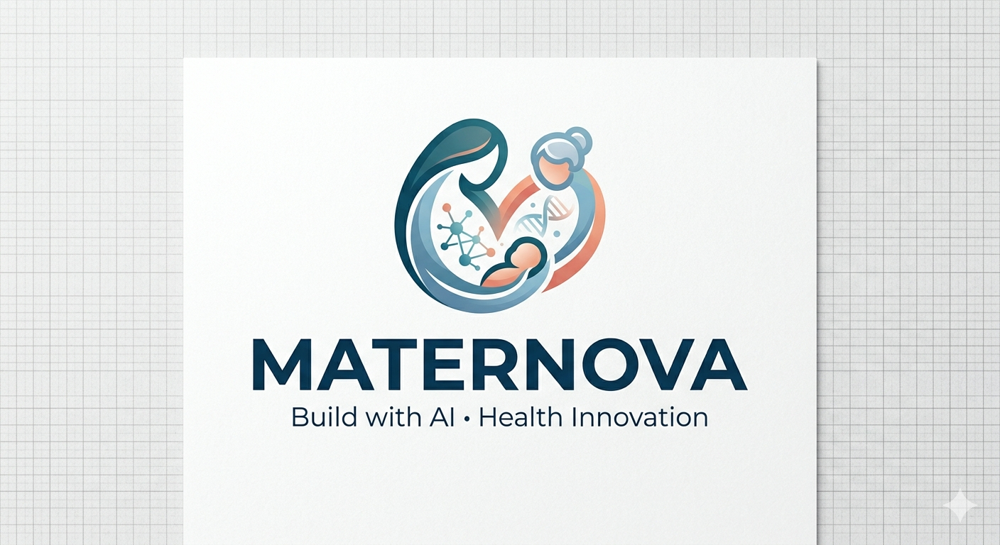
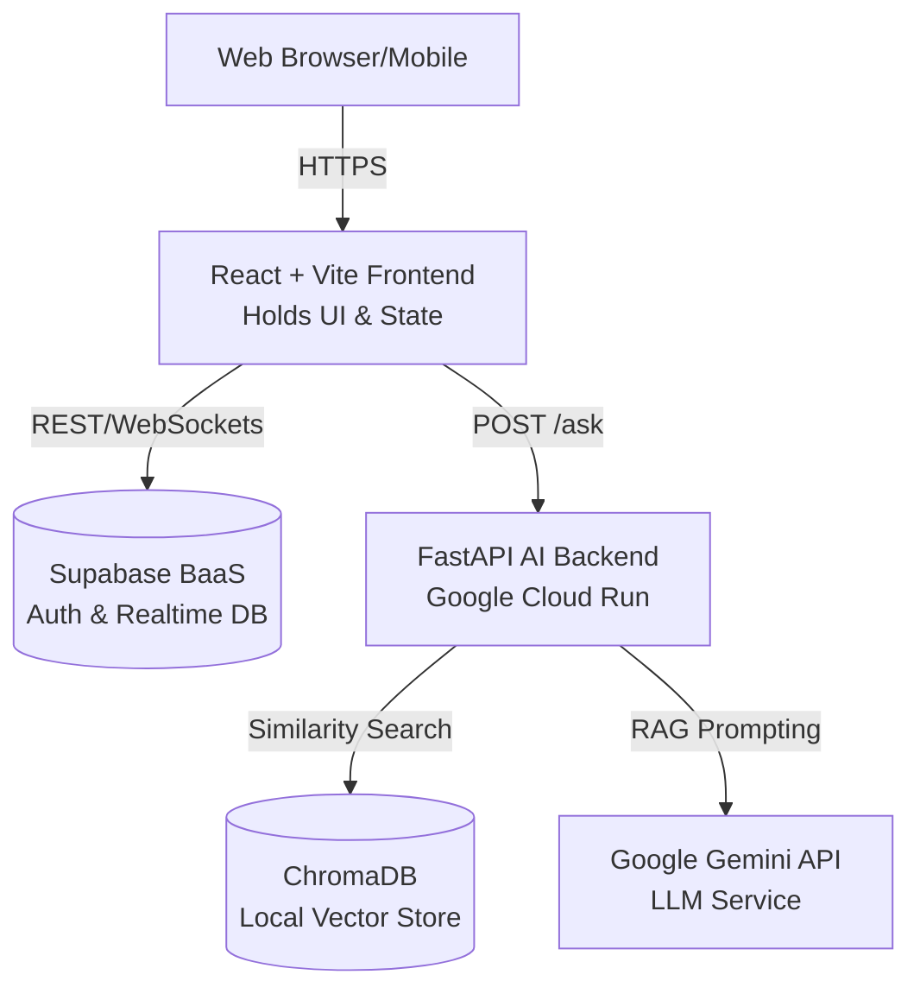

<div align="center">
  

  <h1>🚀 Maternova Healthcare Platform</h1>
  
  <p>
    <strong>Empowering Rural India through Digital Health & AI</strong>
  </p>

  <p>
    <a href="https://maternova-build-with-ai-m577.vercel.app/"></a>
    <a href="https://maternova-build-with-ai-307876886397.asia-south2.run.app/docs"></a>
    
    
  </p>
</div>

---

## 📑 Table of Contents
- [The Vision](#-the-vision)
- [UN Sustainable Development Goals (SDGs)](#-un-sustainable-development-goals-sdgs)
- [Quick Links](#-quick-links)
- [Key Features](#-key-features)
- [System Architecture](#-system-architecture)
- [Tech Stack](#-tech-stack)
- [Getting Started Locally](#-getting-started-locally)

---

## 🌟 The Vision

In rural India, access to healthcare information and timely intervention is a challenge. **Maternova** bridges this gap by connecting **ASHA workers**, **pregnant women**, **elderly citizens**, and **infant families** to essential health services. Powered by a modern web interface and an intelligent AI assistant, Maternova brings healthcare to the fingertips of those who need it most.

---

## 🌍 UN Sustainable Development Goals (SDGs)

Maternova is built with a core mission to address the following UN SDGs:

- **Goal 3: Good Health and Well-being** 🩺
  By providing digital portals for maternal care, infant vaccination tracking, and elderly support, Maternova ensures healthy lives and promotes well-being for all at all ages in rural communities.
- **Goal 10: Reduced Inequalities** 🤝
  Through full support for **12 Indian regional languages** and an intuitive UI designed for varied digital literacy levels, Maternova reduces healthcare access inequalities for marginalized and rural populations.

---

## 🔗 Quick Links

| Resource | URL | Description |
| :--- | :--- | :--- |
| **Live Application** | [maternova-build-with-ai-m577.vercel.app](https://maternova-build-with-ai-m577.vercel.app/) | The production frontend application for users. |
| **API Documentation** | [Backend Docs](https://maternova-build-with-ai-307876886397.asia-south2.run.app/docs) | OpenAPI (Swagger) documentation for the AI backend. |
| **Hackathon Details** | [Solution Challenge 2026](https://hack2skill.com/event/build-with-ai) | Build with AI Google Hackathon page. |

---

## ✨ Key Features

- **🏥 Role-Based Access:** Dedicated portals tailored for ASHA Workers, Pregnant Women, Elderly, and Infant Families.
- **🚨 Emergency Alert System:** Real-time synchronization via Supabase for immediate medical response.
- **💉 Health Tracking:** Comprehensive dashboards for vaccination schedules and treatment records.
- **🍽️ Nutrition Management:** Meal planning and nutritional tracking for maternal and infant health.
- **💰 Funding Tracker:** Access and track government healthcare funding schemes seamlessly.
- **🤖 Maternova AI Assistant:** A specialized RAG-powered chatbot (backed by Gemini and ChromaDB) providing instant, contextual answers.
- **🌐 True Multilingual Support:** Accessible in **12 Indian languages** to ensure no one is left behind.
- **🪟 Liquid Glass UI:** Premium glassmorphism design with animated gradient backgrounds for a stunning user experience.

---

## 🏗️ System Architecture



---

## 💻 Tech Stack

Maternova is built with modern, scalable technologies to ensure high performance and reliability.

| Category | Technologies |
| :--- | :--- |
| **Frontend** | React 18, TypeScript, Vite, Tailwind CSS, shadcn/ui |
| **Backend** | FastAPI, Uvicorn, Python 3.11+ |
| **AI / NLP** | LangChain, Google Gemini API, ChromaDB (Vector Search) |
| **Database** | Supabase (PostgreSQL, Authentication, Realtime subscriptions) |
| **Styling** | Glassmorphism, Animated Gradients, Radix UI Primitives |
| **Deployment** | Vercel (Frontend), Google Cloud Run (Backend) |

---

## 🚀 Getting Started Locally

### Prerequisites
- Node.js (v18+)
- Python 3.11+
- Supabase Project & Google Gemini API Key

### Installation

**1. Clone the Repository**
```bash
git clone https://github.com/damanknows/maternova_build_with_ai.git
cd maternova_build_with_ai
```

**2. Environment Configuration**
```bash
cp .env.example .env
# Open .env and add your Supabase and Gemini API keys.
```

**3. Start the Frontend**
```bash
npm install
npm run dev
# Frontend will be available at http://localhost:8080
```

**4. Start the AI Backend**
```bash
pip install -r requirements.txt

# (First run only) Build the AI Knowledge Base Vector DB:
python ingest.py

# Start the FastAPI server:
python main.py
# Backend API will be available at http://localhost:8000
```

---

## 🛡️ Security Best Practices

- All sensitive keys (`.env`) and vector databases (`maternova_db/`) are strictly `.gitignore`d.
- **CORS Restricted:** Backend only accepts requests from allowed frontend origins.
- API requests are validated and API keys are never exposed to the client side.

---

<div align="center">
  <p>Built with ❤️ for the <strong>Build with AI Solution Challenge 2026</strong> to revolutionize rural healthcare.</p>
</div>
